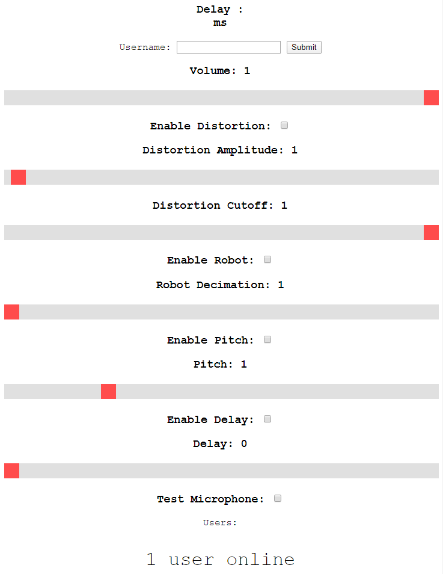

# Voice Changer Test

This voicechanger demo provides multiuser communication with various configurable voice effects.

Implementation was done in websockets rather than p2p methods such as WebRTC as a learning exercise to learn websockets
and to allow existing python code to be used.



## Setup (HTTP)

This is best for usage on a LAN and does not require a web domain. 

1.  Install [Docker Engine](https://docs.docker.com/engine/install/#server) and [Docker Compose](https://docs.docker.com/compose/install/).

2.  Rename the docker-compose.yml.default to docker-compose.yml

```bash
mv docker-compose.yml.default docker-compose.yml
```

3.  Run docker-compose in the project directory

```bash
sudo docker-compose up
```

## Setup (HTTPS) 

1.  Install [Docker Engine](https://docs.docker.com/engine/install/#server) and [Docker Compose](https://docs.docker.com/compose/install/).

2.  Rename the docker-compose.yml.secure to docker-compose.yml

```bash
mv docker-compose.yml.default docker-compose.yml
```

3.  Edit the docker-compose.yml to change the -URL=mydomain.com to the domain you are hosting the server on

4.  Edit the www/client.html and change the url used in websocket creation "wss://mydomain.com/ws" to your own domain. ex "wss://otherdomain.com/ws"

5.  Run docker-compose in the project directory

```bash
sudo docker-compose up
```

## Usage

In a webbrowser navigate to the client.html using either your domain for https or LAN ip for http (ex https://mydomain.com/client.html or 192.x.x.x/client.html)

Click test microphone to hear yourself and effects applied.

Have someone else join to hear eachothers voicechangers. (this might not work on a LAN due to webbrowser security constraints).
